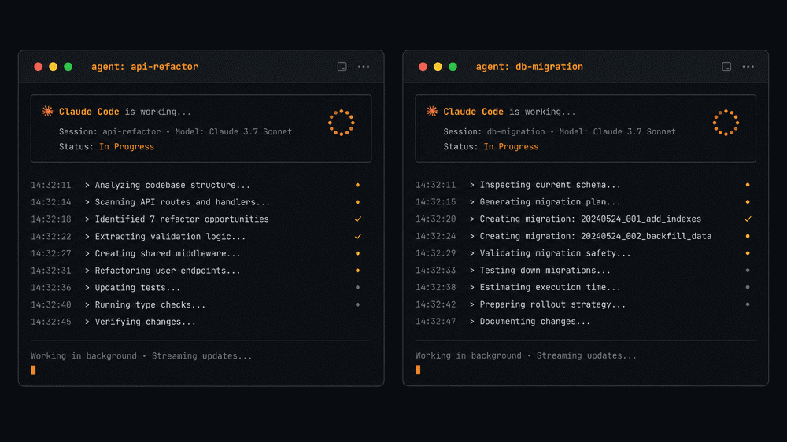

# bgent

**A collision radar and communication bus for background Claude Code sessions.** When two
of your sessions touch the same file, each is warned before it steps on the other. They also
message each other and stay aware of what the others are doing, scoped per project and
delivered into their context automatically. Zero dependencies (Python stdlib only).



## The problem

Claude Code can run sessions in the background (`claude --bg`, the `claude agents` view).
They show up in a list, but they're islands: there's no native way for one session to
message another, and no way for a session to know what the others are doing. You end up
re-explaining context across sessions by hand.

bgent fixes that. Sessions message each other through a shared bus, and each session pulls
the others' messages and status into its own context automatically, through hooks.

## Install

bgent is a Claude Code plugin:

```
/plugin marketplace add leonardocandiani/bgent
/plugin install bgent@bgent
```

That's it. The MCP server and the delivery hooks ship with the plugin, nothing to wire
into `settings.json` by hand. Update later from `/plugin` (or `claude plugin update bgent`).

Requirements: the `claude` CLI on your `PATH`, and Python 3.8+ (stdlib only, nothing to
`pip install`).

Four ideas:

1. **Discovery, native.** bgent asks `claude agents --json` who exists. The Claude Code
   daemon is the source of truth, so there's no registration step that can drift or break.

2. **Snapshots, off the hot path.** On `Stop`, a session reads the tail of its own transcript
   and writes a small snapshot: its project, the files it touched, its current focus, where it
   stopped. The expensive work happens here, once per turn (~21ms on an 11MB transcript), never
   on the path that runs before every prompt.

3. **Collision radar, project-scoped.** Before each prompt, bgent cross-references the files
   you touched against the other live sessions *in the same project* and warns you when they
   overlap ("'X' is also working on app.ts, sync before editing"). Project is resolved from the
   real repo root (`git rev-parse --show-toplevel`); a session with no resolvable project stays
   a singleton, so one project's sessions never bleed into another's.

4. **Delivery, automatic and quiet.** Hooks push only what's actionable, collisions and direct
   messages, into your context. General awareness ("what is everyone doing") is pull, not push:
   ask for it with `bgent_awareness` when you want it. Most turns inject nothing, and that's the
   point. A durable file inbox under `~/.bgent` backs the messages (locked writes, lossless
   read-marking).

An **MCP server** exposes the bus as native tools so a session can act on it directly.

## Usage

With the plugin installed, delivery is hands-off, you rarely call anything by hand. When
you want to act explicitly, the MCP tools are:

- `bgent_ls` — list sessions and their status.
- `bgent_send` — message a session (by name or id).
- `bgent_broadcast` — message every other session.
- `bgent_awareness` — each peer's goal and touched files, scoped to your project.
- `bgent_inbox` — read this session's inbox.
- `bgent_activity` — publish what this session is doing.

Collisions and direct messages arrive on their own; you only reach for these tools to send
something or to pull a fuller picture with `bgent_awareness`.

## Delivery model: mailbox, not phone

A message lands in the target's inbox and reaches it on its **next turn**. A session that's
actively working picks it up almost immediately, the `Stop` hook continues its turn when a
message is waiting. A session that's fully idle reads it whenever it's next prompted. There
is no supported way, on Claude Code today, to inject input into a parked session from the
outside, so bgent guarantees delivery to the inbox rather than pretending to ring a phone.

## License

MIT. See [LICENSE](LICENSE).
